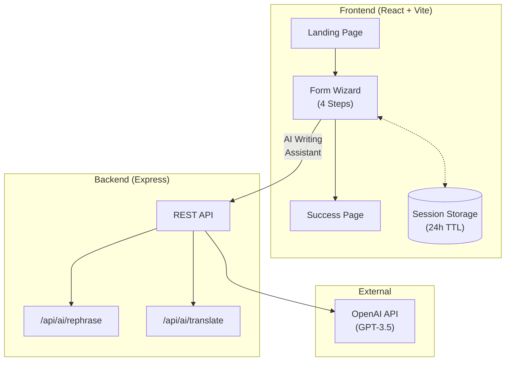

# Abu Dhabi Financial Assistance Portal

A bilingual web app (English/Arabic) for financial assistance applications. Built with React, TypeScript, and AI features.

[](https://react.dev/)
[](https://www.typescriptlang.org/)
[](https://tailwindcss.com/)
[](https://openai.com/)

---

## What is this?

A web application where people can apply for financial assistance. It has a 4-step form with some helpful features:

- AI writing assistant to help describe your situation
- Automatic translation between English and Arabic
- Save your progress and come back later
- Works on phones, tablets, and computers

---

## Screenshots

### English Interface

**Landing Page**

The main landing page introduces the application with a clean hero section. Users can see what the app offers and choose their preferred language before starting.


**Step 1: Personal Information**

This is where users enter basic details like name, Emirates ID, and contact info. The name fields have auto-translation - type in English and it translates to Arabic automatically (and vice versa).


**Step 2: Family & Financial Details**

Here users provide information about their household, employment status, and current income situation.


**Step 3: Situation Description**

This step lets users describe their financial situation and why they need assistance. There's an AI writing assistant to help write clear, professional descriptions.


**AI Writing Assistant**

The AI helper can generate well-written text based on simple prompts. Just describe your situation in a few words and it creates a proper explanation for you.


**Step 4: Review & Confirm**

Before submitting, users can review everything they entered. All information is displayed clearly so they can make sure it's correct.


**Success Page**

After submission, users get a confirmation with a reference number. This number is important for tracking the application.


**Form Validation**

The form checks for errors in real-time. If something's missing or incorrect, it shows helpful messages right below the field.


### Arabic Interface (RTL)

**Landing Page**

The entire interface flips for right-to-left languages. Everything from the layout to the text direction is designed for Arabic readers.


**Step 1: Personal Information**

Form fields work the same way in Arabic, with labels and placeholders in Arabic. The auto-translation feature helps users fill out both language versions easily.


**Step 3: Situation Description**

The AI writing assistant works in Arabic too. It can help write professional descriptions in Arabic based on simple input.


**Unsaved Changes Warning**

If users try to leave with unsaved work, the app asks them to confirm. This prevents accidental loss of progress.


**Success Page**

The confirmation page in Arabic shows the same information - reference number and next steps - but in a format comfortable for Arabic readers.


---

## How to run it

### What you need
- Node.js 18 or newer
- An OpenAI API key

### Setup

```bash
# Clone the repo
git clone https://github.com/yz-abdulrehman-khan/social-support-app.git
cd social-support-app

# Install stuff
npm install

# Create env files
cp .env.example .env
cp .env.server.example .env.server
# Add your OpenAI API key to .env.server

# Run it
npm run dev          # Frontend at http://localhost:3000
npm run dev:server   # Backend at http://localhost:3001
```

### Environment variables

Create `.env` for frontend:

```env
VITE_API_URL=http://localhost:3001
```

Create `.env.server` for backend:

```env
OPENAI_API_KEY=your-key-here
PORT=3001
NODE_ENV=development
FRONTEND_URL=http://localhost:3000
```

---

## Architecture



**Key Features:**
- Bilingual (EN/AR) with full RTL support
- 4-step form wizard with Zod validation
- AI-powered writing assistant & auto-translation
- Session storage for resume journey (24h TTL)
- React Hook Form + react-intl for i18n

---

## Project Structure

```
src/
├── app/
│   ├── providers/          # App state & language context
│   │   ├── AppProvider     # Navigation state, form data, app lifecycle
│   │   └── LanguageProvider# i18n context, RTL, locale switching
│   └── router/             # State-based routing (no react-router)
│       └── AppRouter       # Lazy-loaded route components
│
├── features/               # Feature-based vertical slices
│   ├── landing/            # Landing page with hero, features, CTA
│   ├── application-form/   # Multi-step form wizard
│   │   ├── components/     # FormWizard, Steps 1-4
│   │   ├── hooks/          # useFormWizard (validation, persistence)
│   │   ├── validation/     # Zod schemas, formatters
│   │   └── types/          # TypeScript types, shared constants
│   └── success/            # Success confirmation page
│
├── components/
│   ├── ui/                 # Reusable UI primitives
│   │   ├── button, input, select, textarea
│   │   ├── form (react-hook-form integration)
│   │   ├── date-picker (react-datepicker + RTL)
│   │   ├── dialog, alert-dialog
│   │   └── TypingText (typewriter animation)
│   ├── layout/             # Header, footer
│   ├── modals/             # AIWritingAssistant
│   └── error/              # Error fallback components
│
├── hooks/                  # Shared custom hooks
│   └── useRTL              # RTL direction utilities
│
├── lib/                    # Utilities
│   ├── i18n/               # Internationalization utilities
│   │   ├── utils           # Arabic numerals, formatting
│   │   └── zod-adapter     # Zod-to-react-intl error mapping
│   ├── secureStorage       # AES-256-GCM encrypted storage
│   └── utils               # cn() classname utility
│
├── services/               # API layer
│   ├── apiClient           # Axios client with error handling
│   └── aiService           # OpenAI service wrapper
│
├── config/                 # Application configuration
│   ├── constants           # UI constants, storage keys
│   ├── validation          # Validation patterns, messages
│   └── formData            # GCC countries, cities, options
│
└── locales/                # i18n translation files
    ├── en.json             # English (287 keys)
    └── ar.json             # Arabic (287 keys)

server/
├── index.ts                # Express server entry
├── routes/ai.ts            # AI API routes
├── controllers/            # Request handlers
│   └── aiController        # Rephrase, translate
├── middleware/             # Express middleware
│   ├── errorHandler        # Global error handling
│   ├── requestLogger       # Request logging
│   └── validation          # Zod validation middleware
├── validators/             # Request validation schemas
└── utils/errors.ts         # Custom error classes
```

---

## Tech used

- **Frontend:** React, TypeScript, Vite, Tailwind CSS
- **Form handling:** React Hook Form with validation
- **Languages:** English and Arabic (287 translations each)
- **AI:** OpenAI GPT-3.5 for text generation and translation
- **Backend:** Express server

---

## API

### Generate AI text

```
POST /api/ai/assist
```

Request:
```json
{
  "prompt": "Help me write about my financial situation",
  "language": "en",
  "context": "financialSituation"
}
```

### Translate text

```
POST /api/ai/translate
```

Request:
```json
{
  "text": "John Smith",
  "targetLanguage": "ar"
}
```

---


## Contributing

```bash
# Create a branch
git checkout -b your-feature

# Make changes
npm run dev

# Commit
git add .
git commit -m "what you did"

# Push
git push origin your-feature
```

---

## License

Do whatever you want with it

---

## Contact

- **Issues:** [GitHub Issues](https://github.com/yz-abdulrehman-khan/social-support-app/issues)
- **Email:** yz.abdulrehman.khan@gmail.com
