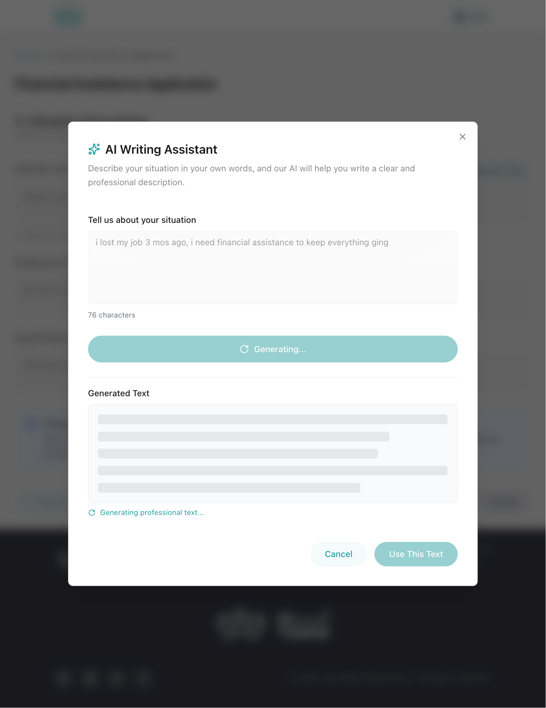
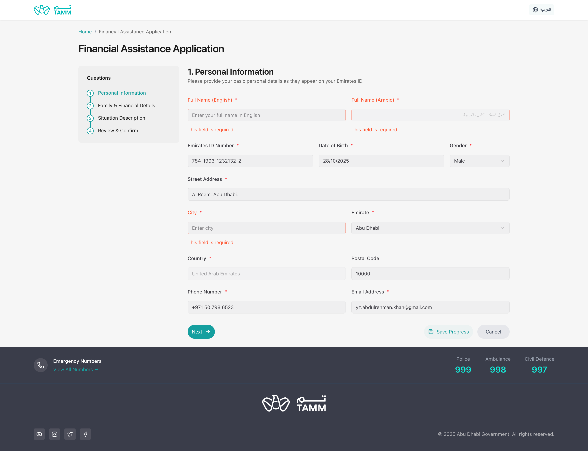

# Abu Dhabi Financial Assistance Portal

A bilingual web app (English/Arabic) for financial assistance applications. Built with React, TypeScript, and AI features.

[](https://react.dev/)
[](https://www.typescriptlang.org/)
[](https://tailwindcss.com/)
[](https://openai.com/)

---

## What is this?

A web application where people can apply for financial assistance. It has a 4-step form with some helpful features:

- AI writing assistant to help describe your situation
- Automatic translation between English and Arabic
- Save your progress and come back later
- Works on phones, tablets, and computers

---

## Screenshots

### English Interface

**Landing Page**


**Form Step 1: Personal Information**


**Form Step 2: Family & Financial Details**


**Form Step 3: Situation Description**


**AI Writing Assistant**




**Form Step 4: Review & Confirm**


**Success Confirmation**


**Form Validation**


### Arabic Interface (RTL)

**Landing Page**


**Form Step 1: Personal Information**


**Form Step 3: Situation Description with AI**


**Success Confirmation**


---

## How to run it

### What you need
- Node.js 18 or newer
- An OpenAI API key

### Setup

```bash
# Clone the repo
git clone https://github.com/yz-abdulrehman-khan/social-support-app.git
cd social-support-app

# Install stuff
npm install

# Create env files
cp .env.example .env
cp .env.server.example .env.server
# Add your OpenAI API key to .env.server

# Run it
npm run dev          # Frontend at http://localhost:5173
npm run dev:server   # Backend at http://localhost:3001
```

### Environment variables

Create `.env` for frontend:

```env
VITE_API_URL=http://localhost:3001
```

Create `.env.server` for backend:

```env
OPENAI_API_KEY=your-key-here
PORT=3001
NODE_ENV=development
FRONTEND_URL=http://localhost:3000
```

---

## Project structure

```
social-support-app/
├── src/
│   ├── app/
│   │   ├── providers/
│   │   │   ├── AppProvider.tsx        # Global app state
│   │   │   └── LanguageProvider.tsx   # Language switching
│   │   └── router/
│   │       └── AppRouter.tsx          # Route management
│   ├── features/
│   │   ├── landing/
│   │   │   ├── components/
│   │   │   │   ├── Hero.tsx           # Landing hero section
│   │   │   │   ├── Features.tsx       # Feature cards
│   │   │   │   └── LanguageToggle.tsx # Language switcher
│   │   │   └── index.ts
│   │   ├── application-form/
│   │   │   ├── components/
│   │   │   │   ├── FormWizard.tsx     # Main form container
│   │   │   │   ├── ProgressBar.tsx    # Step progress indicator
│   │   │   │   └── steps/
│   │   │   │       ├── StepOne.tsx    # Personal info
│   │   │   │       ├── StepTwo.tsx    # Family & financial
│   │   │   │       ├── StepThree.tsx  # Situation description
│   │   │   │       └── StepFour.tsx   # Review & confirm
│   │   │   ├── hooks/
│   │   │   │   └── useFormWizard.ts   # Form state management
│   │   │   ├── validation/
│   │   │   │   └── schemas.ts         # Zod validation schemas
│   │   │   └── types/
│   │   │       └── index.ts           # TypeScript types
│   │   └── success/
│   │       └── SuccessConfirmation.tsx # Success page
│   ├── components/
│   │   ├── ui/                        # Radix UI components
│   │   │   ├── button.tsx
│   │   │   ├── input.tsx
│   │   │   ├── select.tsx
│   │   │   ├── date-picker.tsx
│   │   │   └── dialog.tsx
│   │   ├── layout/
│   │   │   ├── Header.tsx
│   │   │   ├── Footer.tsx
│   │   │   └── Breadcrumb.tsx
│   │   └── ErrorBoundary.tsx
│   ├── lib/
│   │   ├── secureStorage.ts           # AES encryption
│   │   └── i18n.ts                    # i18n utilities
│   ├── services/
│   │   └── aiService.ts               # OpenAI API calls
│   ├── locales/
│   │   ├── en.json                    # English translations
│   │   └── ar.json                    # Arabic translations
│   ├── config/
│   │   ├── constants.ts               # App constants
│   │   ├── formData.ts                # Form options/data
│   │   └── validation.ts              # Validation rules
│   └── main.tsx                       # App entry point
├── server/
│   ├── index.ts                       # Express server
│   └── routes/
│       └── ai.ts                      # AI endpoints
├── public/                            # Static assets
├── screenshots/                       # App screenshots
├── .env                               # Frontend env
├── .env.server                        # Backend env
└── package.json
```

---

## Tech used

- **Frontend:** React, TypeScript, Vite, Tailwind CSS
- **Form handling:** React Hook Form with validation
- **Languages:** English and Arabic (287 translations each)
- **AI:** OpenAI GPT-3.5 for text generation and translation
- **Backend:** Express server

---

## API

### Generate AI text

```
POST /api/ai/assist
```

Request:
```json
{
  "prompt": "Help me write about my financial situation",
  "language": "en",
  "context": "financialSituation"
}
```

### Translate text

```
POST /api/ai/translate
```

Request:
```json
{
  "text": "John Smith",
  "targetLanguage": "ar"
}
```

---


## Contributing

```bash
# Create a branch
git checkout -b your-feature

# Make changes
npm run dev

# Commit
git add .
git commit -m "what you did"

# Push
git push origin your-feature
```

---

## License

Do whatever you want with it

---

## Contact

- **Issues:** [GitHub Issues](https://github.com/yz-abdulrehman-khan/social-support-app/issues)
- **Email:** yz.abdulrehman.khan@gmail.com

---

**Built for Abu Dhabi Government Services**
