# Abu Dhabi Financial Assistance Portal

A bilingual web app (English/Arabic) for financial assistance applications. Built with React, TypeScript, and AI features.

[](https://react.dev/)
[](https://www.typescriptlang.org/)
[](https://tailwindcss.com/)
[](https://openai.com/)

---

## What is this?

A web application where people can apply for financial assistance. It has a 4-step form with some helpful features:

- AI writing assistant to help describe your situation
- Automatic translation between English and Arabic
- Save your progress and come back later
- Works on phones, tablets, and computers

---

## What's Inside

**Stack:**

- React 19 with hooks
- TypeScript 5.9 (strict mode)
- Tailwind CSS v4 for styling
- ShadCN UI components
- Vite for fast builds
- Zod for validation
- react-hook-form for form management
- react-intl for English/Arabic support with RTL
- OpenAI GPT-3.5 for AI features

---

## How to Run

```bash
# Install stuff
npm install

# Create env files
cp .env.example .env
cp .env.server.example .env.server
# Add your OpenAI API key to .env.server

# Start the backend (runs on port 3001)
npm run dev:server

# Start the frontend (runs on port 3000)
npm run dev
```

Open http://localhost:3000 and you're good to go.

### Environment Variables

**.env** (frontend):
```env
VITE_API_URL=http://localhost:3001
```

**.env.server** (backend):
```env
OPENAI_API_KEY=your-key-here
PORT=3001
NODE_ENV=development
FRONTEND_URL=http://localhost:3000
```

---

## Architecture

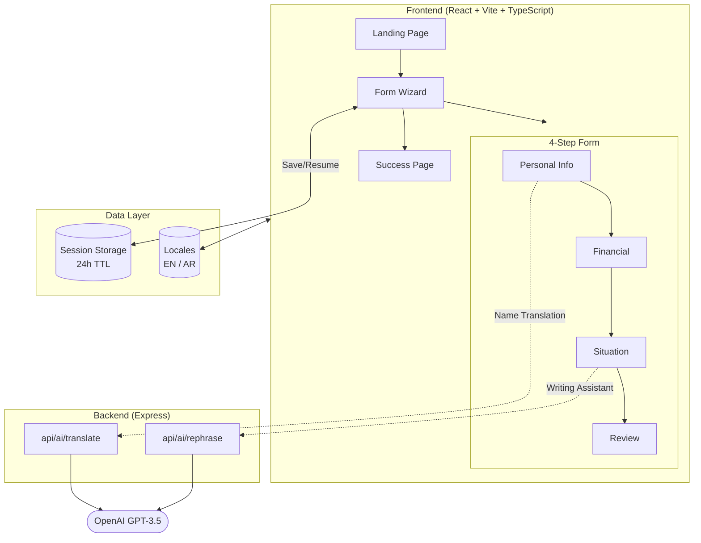

---

## Project Structure

```
src/
├── app/
│   ├── providers/          # App state & language context
│   │   ├── AppProvider     # Navigation state, form data, app lifecycle
│   │   └── LanguageProvider# i18n context, RTL, locale switching
│   └── router/             # State-based routing (no react-router)
│
├── features/               # Feature-based vertical slices
│   ├── landing/            # Landing page with hero, features, CTA
│   ├── application-form/   # Multi-step form wizard
│   │   ├── components/     # FormWizard, Steps 1-4
│   │   ├── hooks/          # useFormWizard (validation, persistence)
│   │   ├── validation/     # Zod schemas
│   │   └── types/          # TypeScript types
│   └── success/            # Success confirmation page
│
├── components/
│   ├── ui/                 # Reusable UI (Button, Input, Select, etc.)
│   ├── layout/             # Header, Footer
│   ├── modals/             # AIWritingAssistant
│   └── error/              # Error fallbacks
│
├── hooks/                  # Custom hooks (useRTL)
├── lib/                    # Utilities (i18n, storage, utils)
├── services/               # API client, AI service
├── config/                 # Constants, validation, form data
└── locales/                # en.json, ar.json (287 keys each)

server/
├── index.ts                # Express server entry
├── routes/ai.ts            # AI API routes
├── controllers/            # Request handlers
├── middleware/             # Error handler, logger, validation
└── validators/             # Zod schemas
```

---

## How It Works

### Data Flow

1. Components use react-hook-form for form state
2. Validation happens with Zod schemas (per step + complete form)
3. AI features call the Express backend
4. Backend calls OpenAI for translation/rephrasing
5. Progress saves to session storage (24h TTL)

No global state library. Just React Context for app state and language. Simple and predictable.

### Why No Redux/Zustand?

The app is small enough that Context + react-hook-form work fine. Form state lives in react-hook-form, app navigation in AppProvider, language in LanguageProvider. If this grew bigger, I'd add React Query before reaching for Redux.

### Translations

Two JSON files with 287 keys each:
- `locales/en.json` - English
- `locales/ar.json` - Arabic

react-intl handles formatting and RTL direction flips automatically.

---

## Features

- ✅ 4-step form wizard with validation
- ✅ AI writing assistant (GPT-3.5)
- ✅ Auto name translation (EN ↔ AR)
- ✅ Save progress & resume later
- ✅ English/Arabic with full RTL support
- ✅ Form validation with Zod
- ✅ Responsive design (mobile, tablet, desktop)
- ✅ Error boundaries with fallbacks
- ✅ Lazy-loaded routes

---

## Design Decisions

### State-Based Routing

No react-router. Just a simple switch on `appState`:
- `landing` → Landing page
- `form` → Form wizard
- `success` → Success page

For a 3-page app, this is simpler than setting up a router.

### Session Storage for Progress

Form progress saves to session storage with 24h TTL. Closes when browser closes, expires after a day. No server-side sessions needed.

### Feature-Based Structure

Each feature (`landing`, `application-form`, `success`) has its own folder with components, hooks, validation, and types. When you work on the form, everything you need is in one place.

### AI on the Backend

OpenAI calls go through Express, not directly from the browser. Keeps the API key secure and lets us add rate limiting later.

---

## Screenshots

### English Interface

**Landing Page**


**Step 1: Personal Information**

Name fields have auto-translation - type in English and it translates to Arabic automatically.


**Step 2: Family & Financial Details**

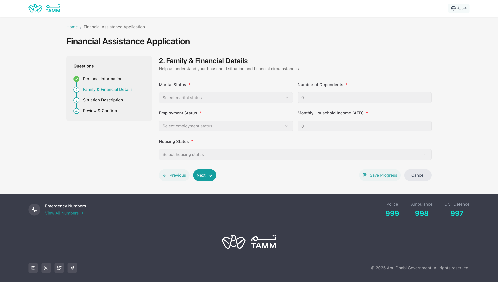

**Step 3: Situation Description**

AI writing assistant helps write professional descriptions.

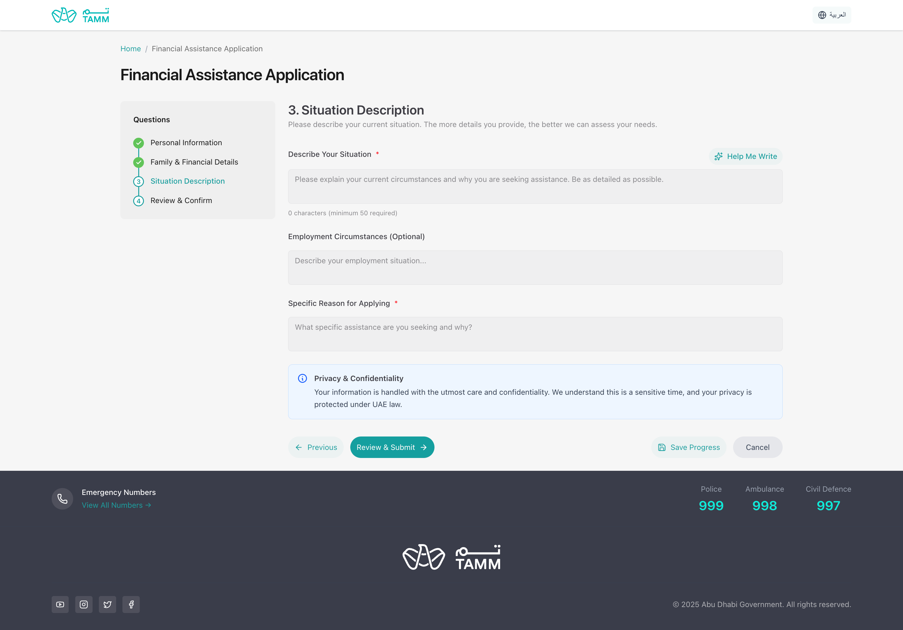

**AI Writing Assistant**

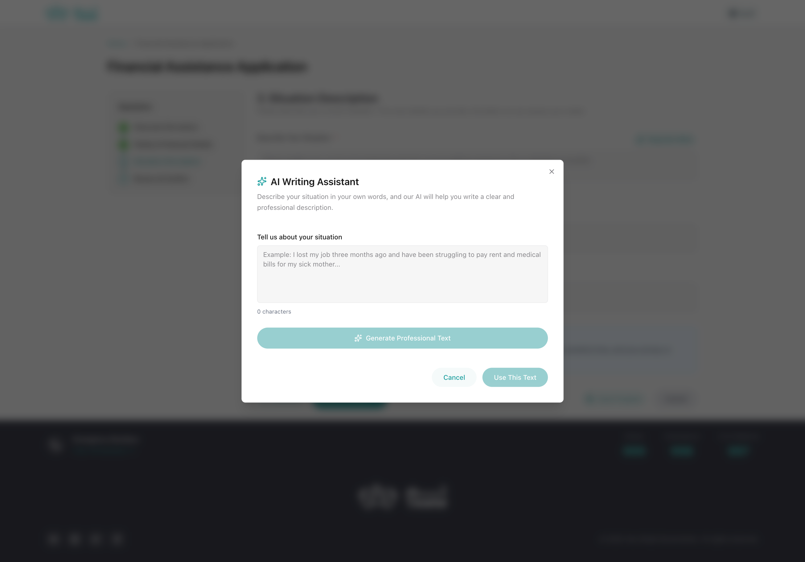
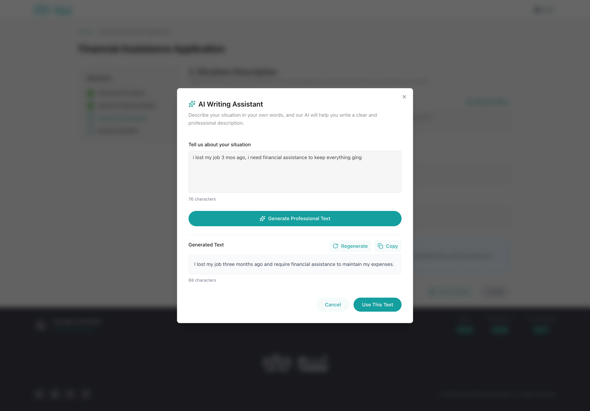

**Step 4: Review & Confirm**

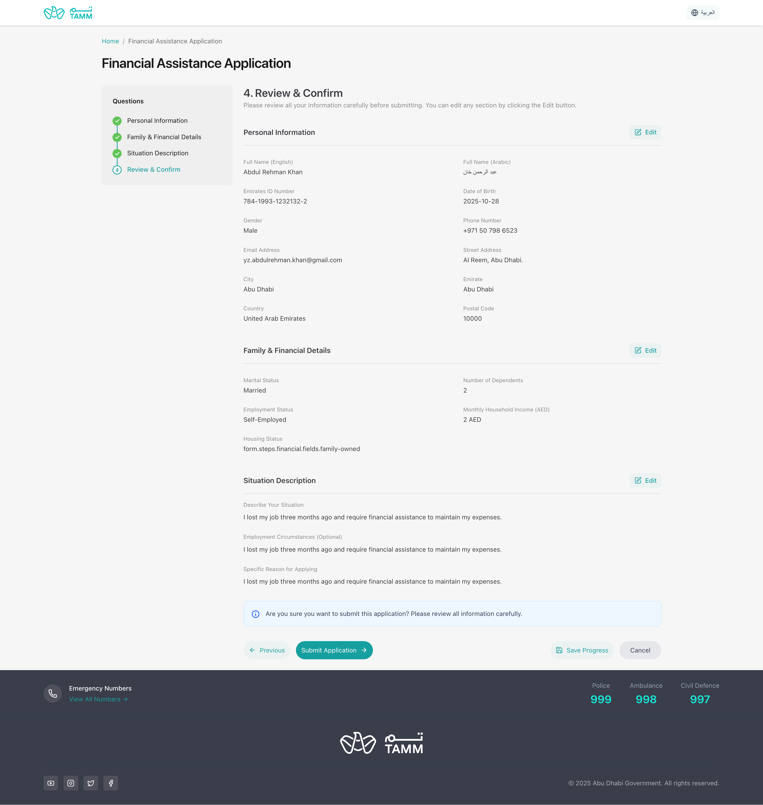

**Success Page**

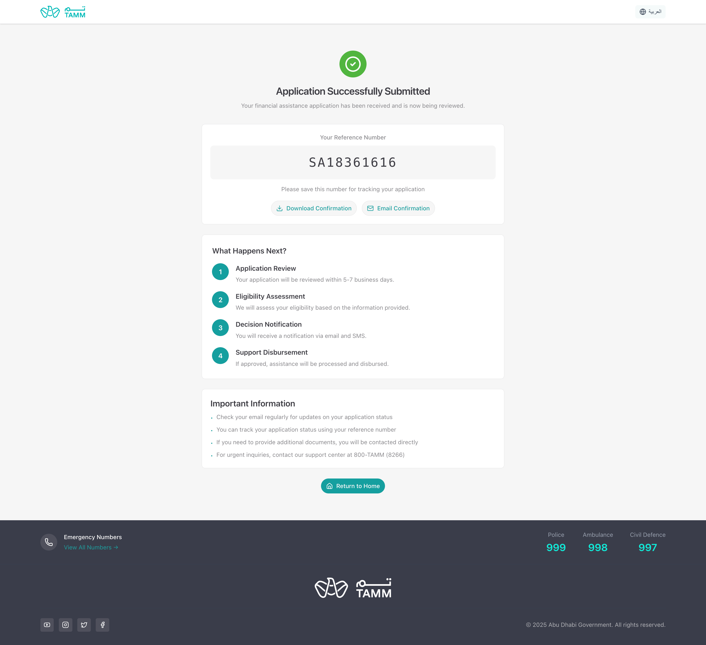

### Arabic Interface (RTL)

The entire interface flips for right-to-left languages.

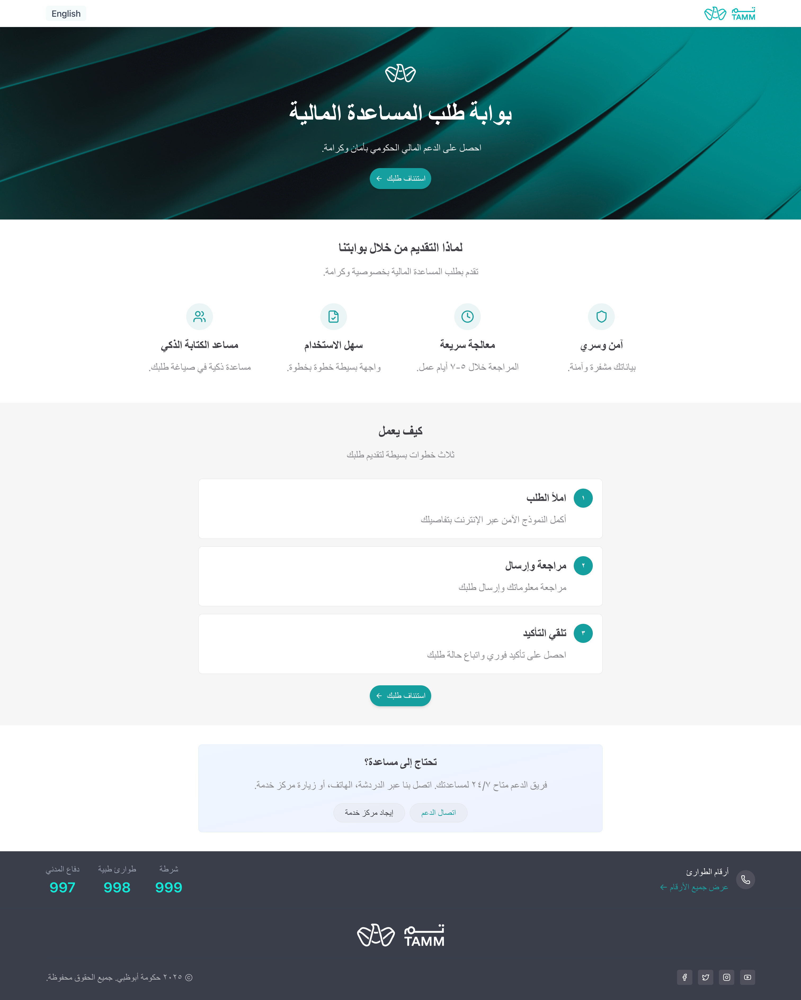
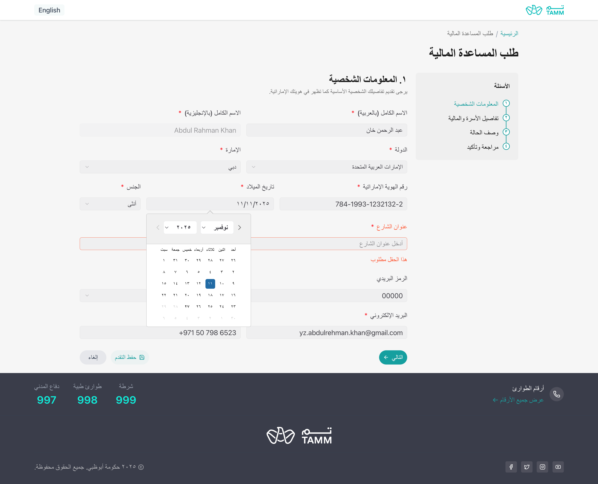
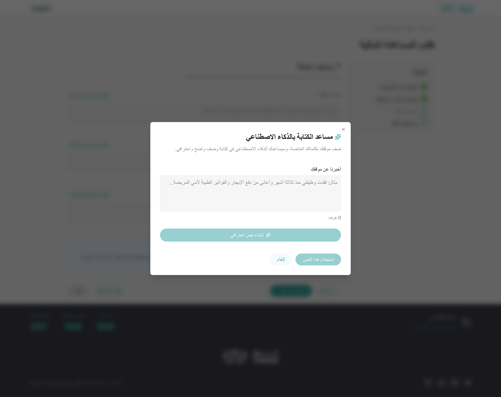
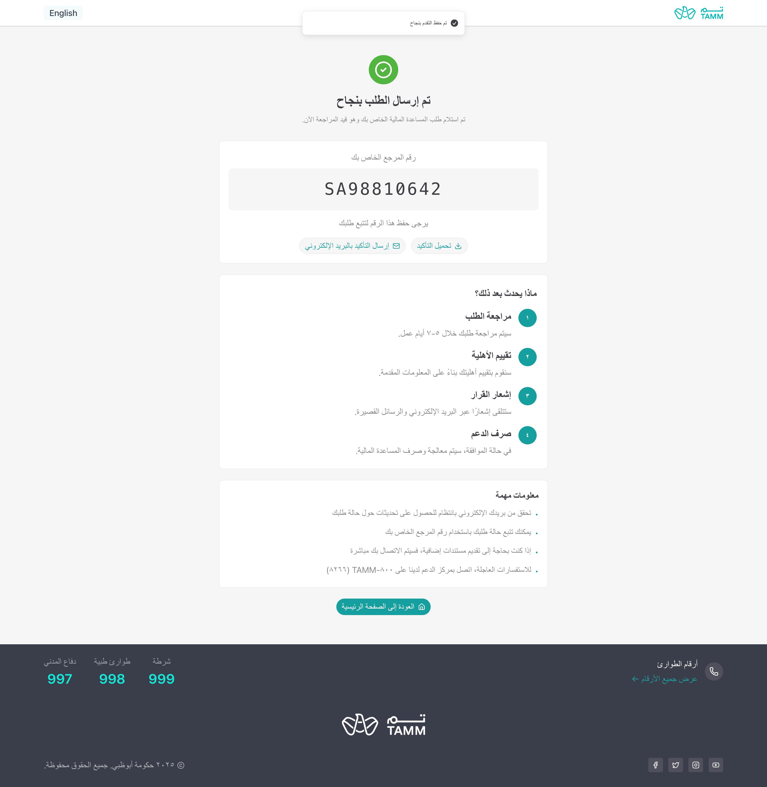

---

## API

### Rephrase Text (Writing Assistant)

```
POST /api/ai/rephrase
```

```json
{
  "text": "i need money because lost job",
  "language": "en"
}
```

Returns professionally written text.

### Translate Name

```
POST /api/ai/translate
```

```json
{
  "text": "John Smith",
  "direction": "toArabic"
}
```

Returns translated name.

---

## What I'd Add Next

If this were a real product:

- **React Query** - Better caching for API calls
- **Tests** - Jest + React Testing Library
- **Storybook** - Component documentation
- **Dark mode** - Because everyone wants dark mode
- **File uploads** - Supporting documents
- **Admin panel** - Review submitted applications
- **Email notifications** - Confirmation emails
- **PDF export** - Download application as PDF

---

## License

Do whatever you want with it.

---

## Contact

- **Issues:** [GitHub Issues](https://github.com/yz-abdulrehman-khan/social-support-app/issues)
- **Email:** yz.abdulrehman.khan@gmail.com
